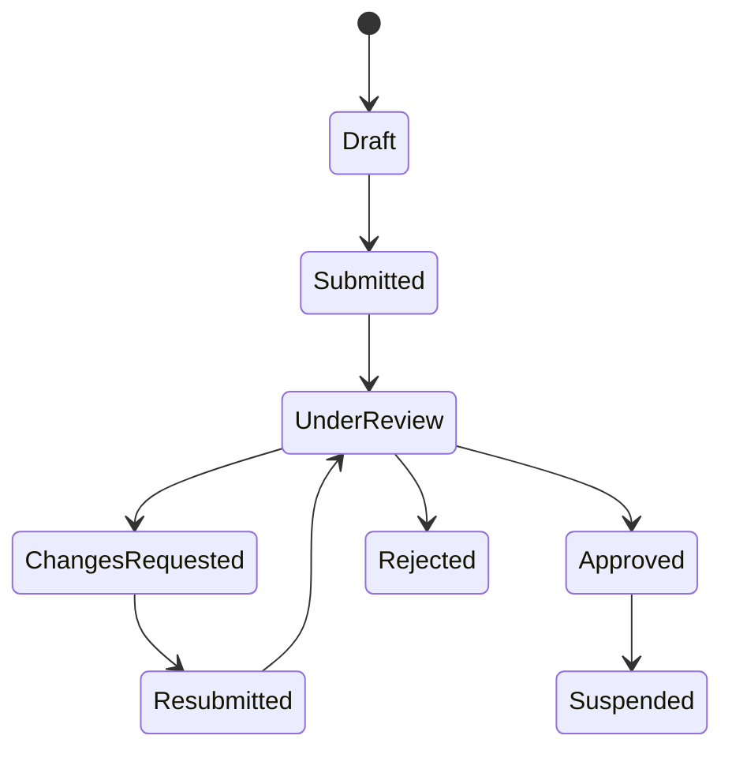
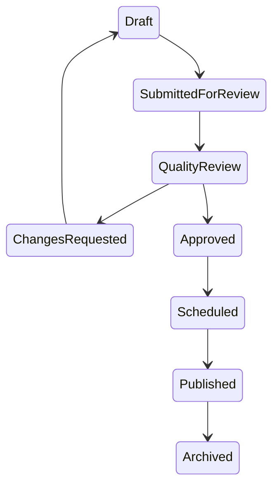
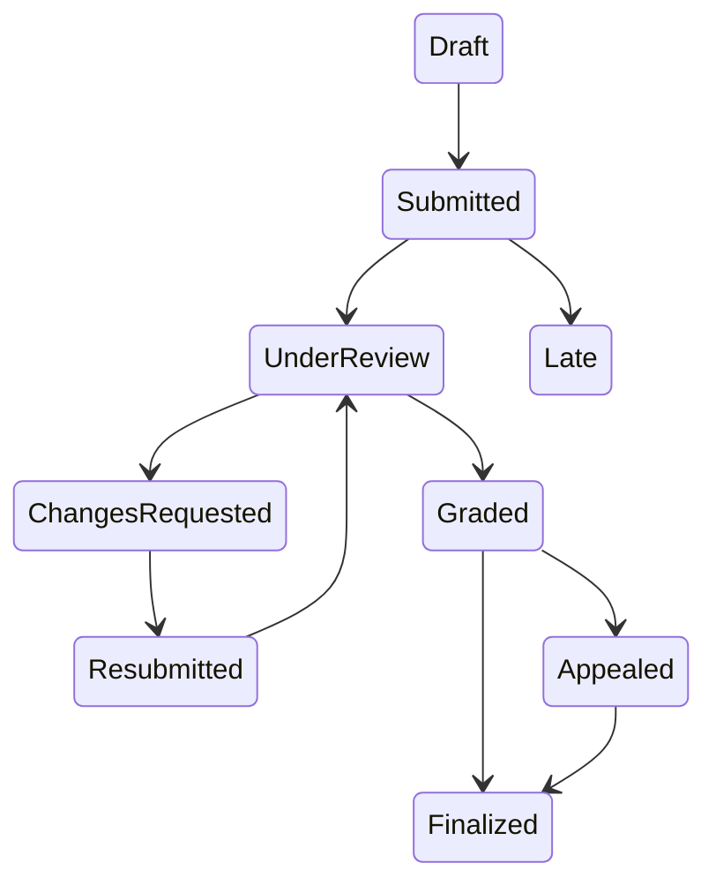
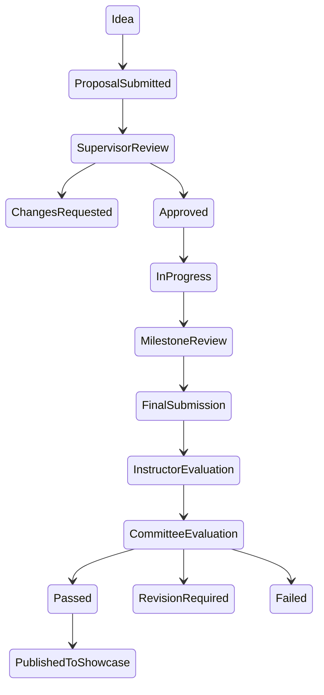
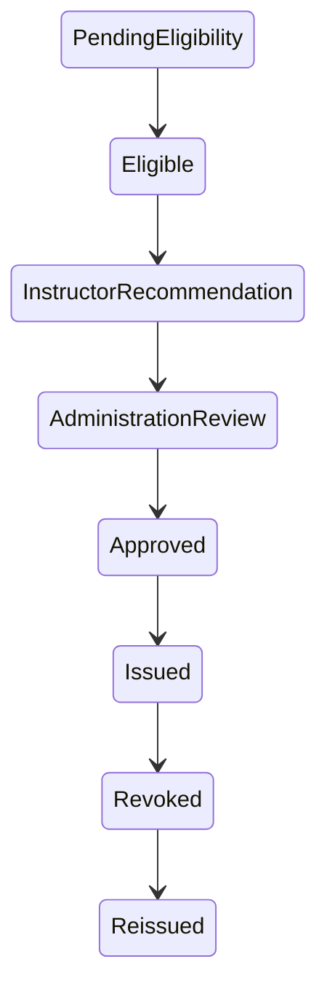

# مسارات الاعتماد

## المحرك العام المستهدف

كل طلب يملك: النوع، مقدم الطلب، المورد، الحالة، الخطوة، المراجعين، التعليقات، المرفقات، SLA، القرارات وسجلها. لا يعتمد المستخدم طلبه في العمليات الحساسة.

## طلب المدرب

## الدورة

## الواجب والتقييم

## مشروع التخرج

## الشهادة

