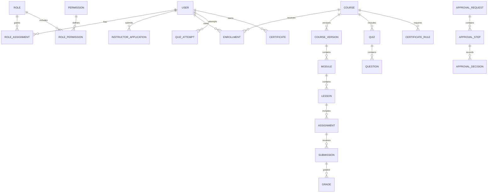

# نموذج البيانات

## الموجود

Users/Sessions، Courses/Sections/Lessons، Enrollments/Progress/Notes، Live Sessions/Attendance، Assignments/Submissions، Activities/Reviews/Skill Scores، Orders/Discounts/Webhooks، Certificates، Notifications/Messages، CRM، CMS، Policies/Accreditations، Feature Flags وAudit Log.

## الإضافات ذات الأولوية

1. Permission، RoleAssignment وPolicy.
2. InstructorApplication وInstructorDocument.
3. CourseVersion وCourseApproval.
4. Quiz، Question، QuizAttempt وإجابات تحفظ وتصحح في الخادم.
5. Rubric، Criterion، Grade وAppeal.
6. CertificateRule وCertificateApproval.
7. ApprovalRequest/Step/Decision.
8. CapstoneProject/Milestone/Evaluation في V1.

## قواعد السلامة

- Unique: `(userId, courseId)` و`(userId, lessonId)` للتقدم والملاحظات، ومفاتيح idempotency للمدفوعات والـwebhooks والتذكيرات.
- Foreign keys وIndexes لجميع مفاتيح البحث والنطاق.
- State values محددة وليست نصوصاً عشوائية.
- إصدار الشهادة Snapshot غير قابل للتعديل الصامت.
- Soft delete حيث يلزم مع `deletedAt/deletedBy/reason`.
- كل كتابة متعددة الخطوات الحساسة داخل Transaction.
