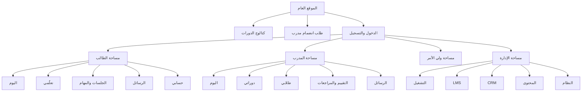

# معمارية المعلومات والتنقل

## الوضع الحالي

- عام: Home، Programs، Workbooks، Gallery، Library، About، Careers، Verify، Policies.
- طالب: `/dashboard` مع خمس وجهات رئيسية ومحتوى تابع.
- تعلم: `/courses/:slug/learn`.
- مدرب: `/trainer` مع روابط تشغيل إلى وحدات الإدارة المسموحة.
- ولي أمر: `/parent`.
- إدارة: خمس مجموعات: نظرة عامة، CRM، LMS، المحتوى، الإعدادات.

## البنية المستهدفة

## قواعد التنقل

- لا يظهر الرأس أو التذييل التسويقيان داخل البوابات أو مشغل التعلم.
- الهاتف: Bottom Navigation للطالب، Drawer/Select للمدرب والإدارة.
- كل وجهة رئيسية تصل في نقرتين بحد أقصى.
- التفاصيل الثانوية داخل Tabs/Accordion/Drawer أو صفحة تفاصيل.
- لا يستخدم جدول أفقي للمهام الأساسية على الهاتف؛ يستبدل ببطاقات ملخصة.
